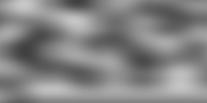
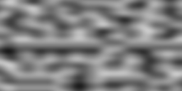
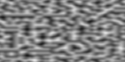
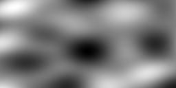
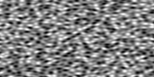
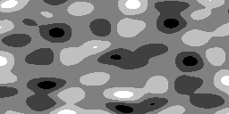
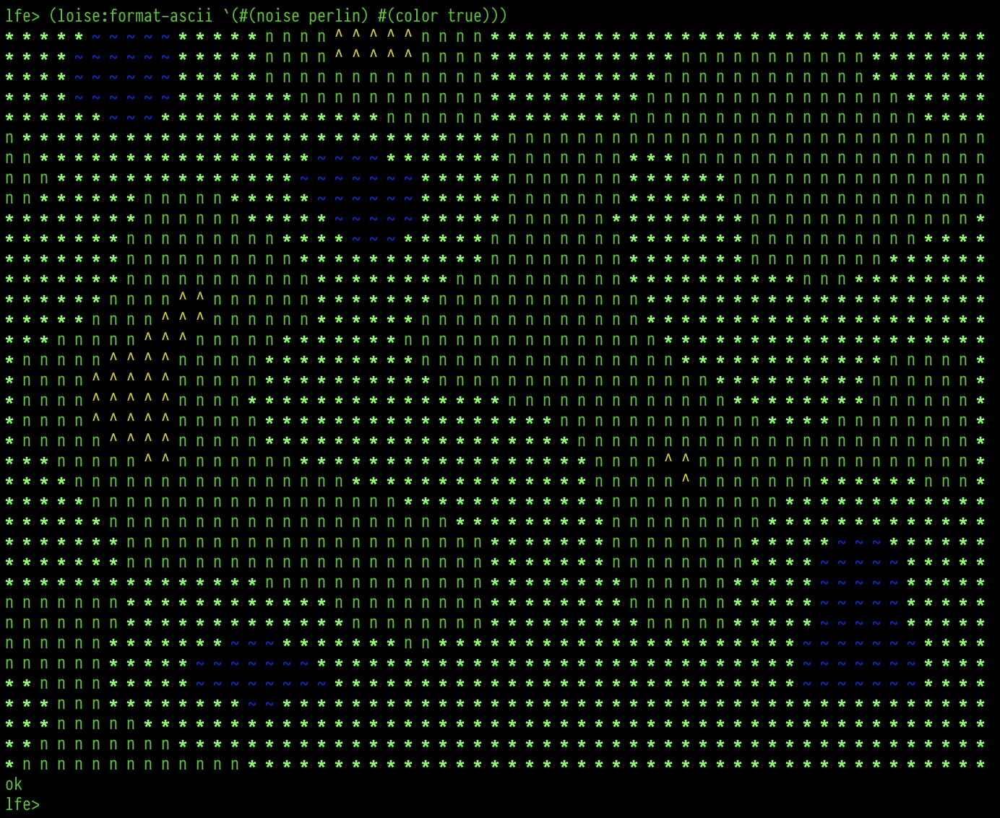
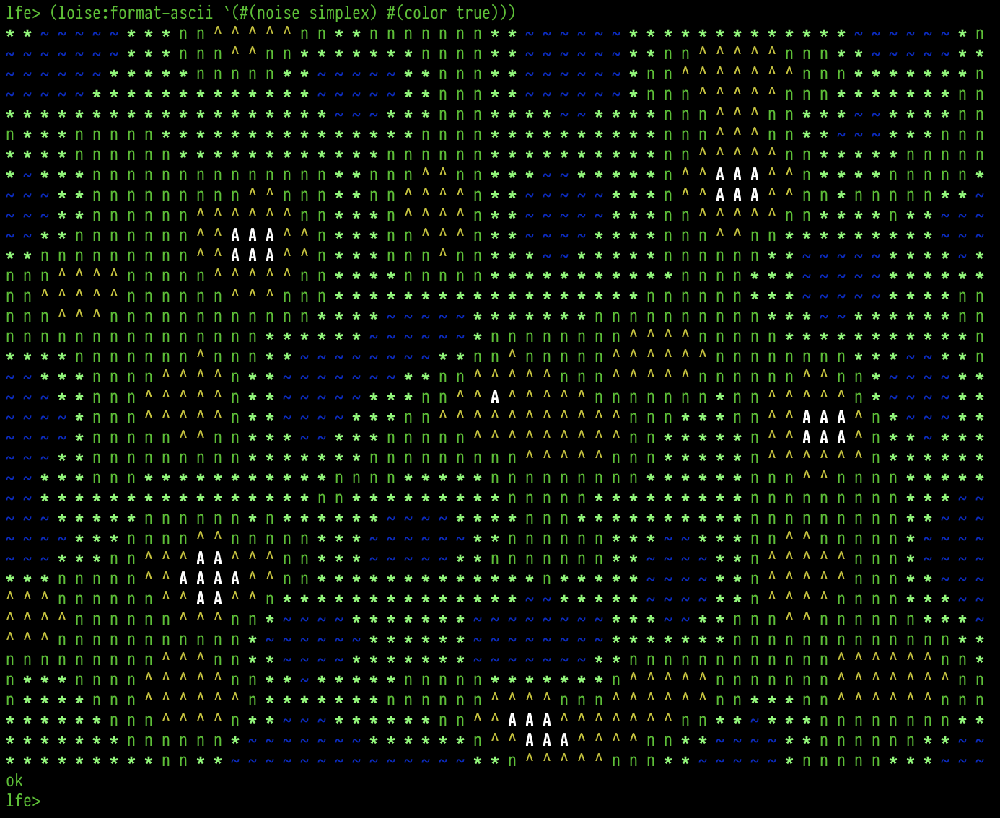
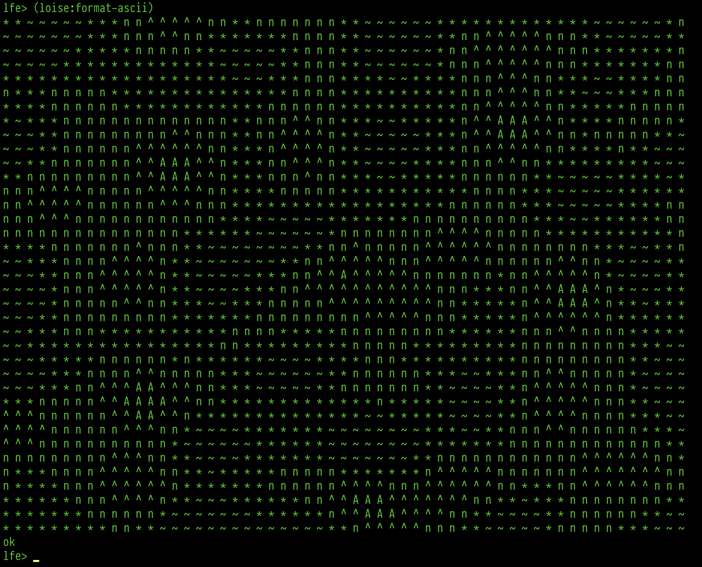
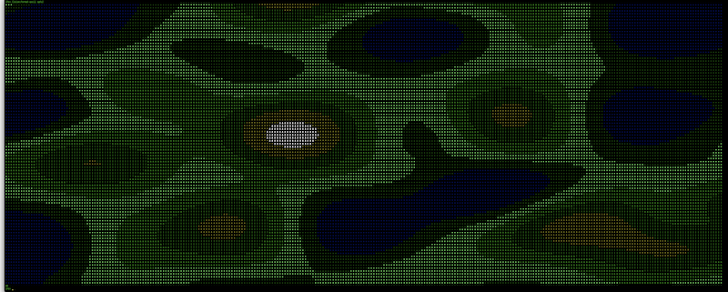

# Loise

[![Build Status][gh-actions-badge]][gh-actions]
[![LFE Versions][lfe badge]][lfe]
[![Erlang Versions][erlang badge]][versions]
[![Tags][github tags badge]][github tags]

*A noise library for LFE/Erlang*

[![Loise project logo][logo]][logo]


#### Contents

* [Introduction](#introduction-)
* [Background](#background-)
* [Dependencies](#dependencies-)
* [Eye Candy](#eye-candy-)
  * [Perlin](#perlin-)
  * [Simplex](#simplex-)
  * [ASCII](#ascii-)
* [Usage](#usage-)
  * [From the REPL](#from-the-repl-)
  * [In a Module](#in-a-module-)
* [License](#license-)


## Introduction [&#x219F;](#contents)

This is a library, written in [LFE](http://lfe.io/), useful for generating
Perlin and Simplex noise. Perlin noise is a computer-generated visual effect
developed by Ken Perlin, who won an Academy Award for Technical Achievement for
inventing it. It can be used to simulate elements from nature, and is especially
useful in circumstances where computer memory is limited. (See the complete
[Perlin Wikipedia article](http://en.wikipedia.org/wiki/Perlin_noise).)

Simplex noise, on the other hand, is a method for constructing an n-dimensional
noise function comparable to Perlin noise ("classic" noise) but with a lower
computational overhead, especially in larger dimensions. Ken Perlin designed
the algorithm in 2001 to address the limitations of his classic noise
function, especially in higher dimensions. (See the complete
[Simplex Wikipedia article](http://en.wikipedia.org/wiki/Simplex_noise) for
more.)


## Background [&#x219F;](#contents)

The loise project stated life as a port of the
[Racket noise-generator](https://github.com/jpverkamp/noise) by
[jpverkamp](https://github.com/jpverkamp) to LFE. However, it has undergone
some seriosu refactoring since then, as well as the inclusion of many new
features.


## Dependencies [&#x219F;](#contents)

This project requires that you have Erlang installed (tested with R15B03, R16B03, 17.5, 18.0, and 18.3). It also assumes that you have [rebar3](https://github.com/erlang/rebar3)
installed somwhere in your ``$PATH``.


## Eye Candy [&#x219F;](#contents)

The data generated with the ``perlin`` and ``simplex`` functions can be used to
create images. Erlang is not a good language for image generation, however this
library does provide some convenience functions for generating images.


### Perlin [&#x219F;](#contents)

Below are 5 perlin noise images generated at 1x, 2x, 4x, 8x, and 16x respectively.








These were generated with the following from the REPL:

```cl
lfe> (set opts `(#(noise perlin) 
                 #(output-format png)))
lfe> (loise:image "perlin-1.png" (cons #(multiplier 1) opts))
ok
lfe> (loise:image "perlin-2.png" (cons #(multiplier 2) opts))
ok
lfe> (loise:image "perlin-4.png" (cons #(multiplier 4) opts))
ok
lfe> (loise:image "perlin-8.png" (cons #(multiplier 8) opts))
ok
lfe> (loise:image "perlin-16.png" (cons #(multiplier 16) opts))
ok
```

You can also limit the number of gradations for the shades of grey, giving
the images a more "layered" or "topographical" look:

```cl
> (set grades (loise:gradations 7))
(0 42.5 85.0 127.5 170.0 212.5 255.0)
> (set opts `(#(multiplier 8)
              #(grades ,grades)))
(#(multiplier 8) #(grades (0 42.5 85.0 127.5 170.0 212.5 255.0)))
> (loise-egd:perlin "simplex-7-shades.png" opts)
ok
```

```cl
lfe> (set opts (++ `(#(graded? true)
                     #(grades-count 8)
                     #(multiplier 4))
                     opts))
lfe> (loise:image "perlin-8-shades.png" opts)
ok
```

Which will create the following:


You may also change the permutation table from the default, to one generated
with a random seed:

```cl
lfe> (set opts (++ `(#(random? true)
                     #(graded? false)) opts))
lfe> (loise:image "perlin-rand-1.png" (++ '(#(seed 4)) opts))
ok
lfe> (loise:image "perlin-rand-2.png" (++ '(#(seed (4 2))) opts))
ok
lfe> (loise:image "perlin-rand-3.png" (++ '(#(seed (4 2 42))) opts))
ok
```

### Simplex [&#x219F;](#contents)

Below are 5 simplex noise images generated at 1x, 2x, 4x, 8x, and 16x respectively.







These were generated with the following from the REPL:

```cl
lfe> (set opts `(#(noise simplex) 
                 #(output-format png)))
lfe> (loise:image "simplex-1.png" (cons #(multiplier 1) opts))
ok
lfe> (loise:image "simplex-2.png" (cons #(multiplier 2) opts))
ok
lfe> (loise:image "simplex-4.png" (cons #(multiplier 4) opts))
ok
lfe> (loise:image "simplex-8.png" (cons #(multiplier 8) opts))
ok
lfe> (loise:image "simplex-16.png" (cons #(multiplier 16) opts))
ok
```

(set opts `(#(noise simplex) #(grades-count 5) #(output-format png) #(graded? true) #(multiplier 4)))
(loise:image "simplex-4-graded.png" opts)

Just as with perlin, simplex allows you to limit the number of gradations for
the shades of grey:

```cl
lfe> (set opts (++ `(#(graded? true)
                     #(grades-count 5)
                     #(multiplier 4))))
lfe> (loise:image "simplex-5-shades.png" opts)
ok
```

Which will create the following:



You may also change the permutation table from the default, to one generated
with a random seed:

```cl
lfe> (set opts (++ `(#(random? true)
                     #(graded? false)) opts))
lfe> (loise:image "simplex-rand-1.png" (++ '(#(seed 4)) opts))
ok
lfe> (loise:image "simplex-rand-2.png" (++ '(#(seed (4 2))) opts))
ok
lfe> (loise:image "simplex-rand-3.png" (++ '(#(seed (4 2 42))) opts))
ok
```

You may either pass an integer or a list of 1, 2 or 3 integers as values
for the `seed` option key.

To see the full list of options available be sure to look at the defaults
and options in `include/options.lfe`.

### ASCII [&#x219F;](#contents)

You can also generate ASCII "images" with loise. As an example of this, we can
map the default values represented by this range:

```cl
lfe> (loise:gradations 6)
(0 51.0 102.0 153.0 204.0 255.0)
```

And by this set of ASCII characters:

* Level 6 - ``A``
* Level 5 - ``^``
* Level 4 - ``n``
* Level 3 - ``*``
* Level 2 - ``~``
* Level 1 - ``~``

By making calls like this:

```cl
lfe> (loise:format-ascii `(#(noise perlin) #(color true)))
```


And this:

```cl
lfe> (loise:format-ascii `(#(noise simplex) #(color true)))
```


The default noise type is `simplex` and colors are not used in the
ASCII noise output by default:

``` cl
lfe> (loise:format-ascii)
```




We can pass new options to the function. The following shows the
addition of alpine forests and grasslands and greatly increasing the
map area in the terminal:

```cl
lfe> (set opts
       `(#(color true)
         #(width 282)
         #(height 94)
         #(multiplier 2.5)
         #(grades-count 9)
         #(grades ,(loise:gradations 9))
         #(ascii-map ("A" "^" "!" "n" "*" "-" "~" "~" "~"))
         #(colors (whiteb yellow green
                   green greenb green
                   blue blue blue))))

lfe> (loise:format-ascii opts)
```
<a href="https://raw.githubusercontent.com/lfex/loise/master/priv/images/simplex-ascii-2.png"></a>

By default, loise uses a pre-generated "permutation table" to generate patterns.
You can view this table in `include/options.lfe`. If you would like to
generate your own for more random results, you will need to enable the `random`
option and then generate a new table:

```cl
> (set opts (++ `(#(random true)) opts))
```

If you do not provide your own seed, the provided default will be used. If you
would like a different result each time, you will need to pass a new seed.
For instance:

```cl
lfe> (loise:ascii `(#(noise perlin) #(seed 1) #(random true)))
lfe> (loise:ascii `(#(noise perlin) #(seed 4 2) #(random true)))
lfe> (loise:ascii `(#(noise perlin) #(seed 7 8 9) #(random true)))
```

To see the full list of options available be sure read
`include/options.lfe`.

## Usage [&#x219F;](#contents)

The first place to start is ensuring that the code you obtained works as
expected. To find out, run the unit tests:

```bash
$ cd loise
$ make check
```

### From the REPL [&#x219F;](#contents)

Once everything is working, start up an LFE REPL:

```bash
$ make repl
```

You can now use loise by itself, if you so desire. Here is some example usage:

```cl
lfe> (loise:perlin 3.14 1.59 2.65)
-0.3772216257243449
lfe> (loise:simplex 0.1)
0.4410072765
lfe> (loise:simplex 0.1 0.2)
0.9410934374999996
lfe> (loise:simplex 0.1 0.2 0.9)
-0.07602014100000003
```

Or, iterating over some values in one dimension:

```cl
lfe> (set input (list-comp ((<- x (lists:seq 0 9))) (/ x 10)))
(0.0 0.1 0.2 0.3 0.4 0.5 0.6 0.7 0.8 0.9)
lfe> (list-comp ((<- x input))
       (loise:round
        (loise:perlin x)
        2))
(0.0 0.11 0.23 0.37 0.46 0.5 0.46 0.37 0.23 0.11)
```


``` cl
lfe> (list-comp ((<- x input))
       (list-comp ((<- y input))
         (loise:round
          (loise:perlin x y)
          2)))
```

### In a Module [&#x219F;](#contents)

```cl
(defmodule mymodule
  (export
   (get-perlin-pie 0)
   (get-simplex-pie 0)))

(def get-perlin-pie ()
  (loise:perlin 3.14 1.59 2.65))

(def get-simplex-pie ()
  (loise:simplex 3.14 1.59 2.65))
```


## License [&#x219F;](#contents)

```
Copyright © 2013-2021 Duncan McGreggor

Distributed under the Apache License, Version 2.0.
```


[//]: ---Named-Links---

[org]: https://github.com/lfex
[github]: https://github.com/lfex/loise
[gitlab]: https://gitlab.com/lfex/loise
[gh-actions-badge]: https://github.com/lfex/loise/workflows/ci%2Fcd/badge.svg
[gh-actions]: https://github.com/lfex/loise/actions
[logo]: priv/images/loise.jpg
[lfe]: https://github.com/rvirding/lfe
[lfe badge]: https://img.shields.io/badge/lfe-2.0-blue.svg
[erlang badge]: https://img.shields.io/badge/erlang-19%20to%2024-blue.svg
[versions]: https://github.com/lfex/loise/blob/master/.github/workflows/cicd.yml
[github tags]: https://github.com/lfex/loise/tags
[github tags badge]: https://img.shields.io/github/tag/lfex/loise.svg
[github downloads]: https://img.shields.io/github/downloads/lfex/loise/total.svg
[hex badge]: https://img.shields.io/hexpm/v/loise.svg?maxAge=2592000
[hex package]: https://hex.pm/packages/loise
[hex downloads]: https://img.shields.io/hexpm/dt/loise.svg
