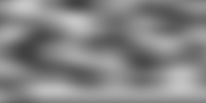
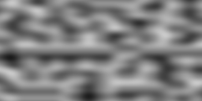
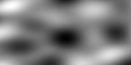

################################
Loise: A Noise-Generator for LFE
################################

.. image:: images/loise.jpg

Introduction
============

This is a library, written in `LFE`_, useful for generating Perlin and Simplex
noise. Perlin noise is a computer-generated visual effect developed by Ken
Perlin, who won an Academy Award for Technical Achievement for inventing it.
It can be used to simulate elements from nature, and is especially useful in
circumstances where computer memory is limited. (See the complete
`Perlin Wikipedia article`_.)

Simplex noise, on the other hand, is a method for constructing an n-dimensional
noise function comparable to Perlin noise ("classic" noise) but with a lower
computational overhead, especially in larger dimensions. Ken Perlin designed
the algorithm in 2001 to address the limitations of his classic noise
function, especially in higher dimensions. (See the complete
`Simplex Wikipedia article`_ for more.)

Background
----------

This is a port of the `Racket noise-generator`_ by `jpverkamp`_ to `LFE`_.

Dependencies
------------

This project assumes that you have `rebar`_ installed somwhere in your
``$PATH``.

This project depends upon the following, which are installed to the ``deps``
directory of this project when you run ``make deps``:

* `LFE`_ (Lisp Flavored Erlang; needed only to compile)
* `lfeunit`_ (needed only to run the unit tests)

Eye Candy
=========

The data generated with the ``perlin`` and ``simplex`` functions can be used to
create images. Erlang is not a good language for image generation, however this
library does provide some convenience functions for generating images.

Perlin
------

Below are 4 perlin noise images generated at 1x, 2x, 4x, and 8x, respectively.

These were generated with the following from the REPL:

.. code:: lisp

    > (: loise-img create-perlin-image '"perlin-1.png" 'png 256 128 1)
    ok
    > (: loise-img create-perlin-image '"perlin-2.png" 'png 256 128 2)
    ok
    > (: loise-img create-perlin-image '"perlin-4.png" 'png 256 128 4)
    ok
    > (: loise-img create-perlin-image '"perlin-8.png" 'png 256 128 8)
    ok

Simplex
-------

Below are 4 simplex noise images generated at 1x, 2x, 4x, and 8x, respectively.

.. image:: images/simplex-4.png

.. image:: images/simplex-8.png

These were generated with the following from the REPL:

.. code:: lisp

    > (: loise-img create-simplex-image '"simplex-1.png" 'png 256 128 1)
    ok
    > (: loise-img create-simplex-image '"simplex-2.png" 'png 256 128 2)
    ok
    > (: loise-img create-simplex-image '"simplex-4.png" 'png 256 128 4)
    ok
    > (: loise-img create-simplex-image '"simplex-8.png" 'png 256 128 8)

Using Loise
===========

The first place to start is ensuring that the code you obtained works as
expected. To find out, run the unit tests:

.. code:: bash

    $ cd loise
    $ make check

From the REPL
-------------

Once everything is working, start up an LFE REPL:

.. code:: bash

    $ make shell

You can now use loise by itself, if you so desire. Here is some example usage:

.. code:: lisp

    > (: loise perlin 3.14 1.59 2.65)
    -0.3772216257243449
    > (: loise simplex 0.1)
    0.4410072765
    > (: loise simplex 0.1 0.2)
    0.9410934374999996
    > (: loise simplex 0.1 0.2 0.9)
    -0.07602014100000003

Or, iterating over some values:

.. code:: lisp

    > (set input
        (: lists map
          (lambda (x)
            (/ x 10))
          (: lists seq 0 9))))
    (0.0 0.1 0.2 0.3 0.4 0.5 0.6 0.7 0.8 0.9)
    > (: lists map
        (lambda (x)
          (: loise round
            (: loise perlin x)
          2))
        input)
    (0.0 0.11 0.23 0.37 0.46 0.5 0.46 0.37 0.23 0.11)

In a Module
-----------

.. code:: lisp

    (defmodule mymodule
      (export all)
      (import
        (from loise
          (perlin 3)
          (simplex 3))))

    (def get-perlin-pie ()
      (perlin 3.14 1.59 2.65))

    (def get-simplex-pie ()
      (simplex 3.14 1.59 2.65))

.. Links
.. -----
.. _Racket noise-generator: https://github.com/jpverkamp/noise
.. _Perlin Wikipedia article: http://en.wikipedia.org/wiki/Perlin_noise
.. _Simplex Wikipedia article: http://en.wikipedia.org/wiki/Simplex_noise
.. _jpverkamp: https://github.com/jpverkamp
.. _LFE: http://lfe.github.io/
.. _rebar: https://github.com/rebar/rebar
.. _lfeunit: https://github.com/lfe/lfeunit
